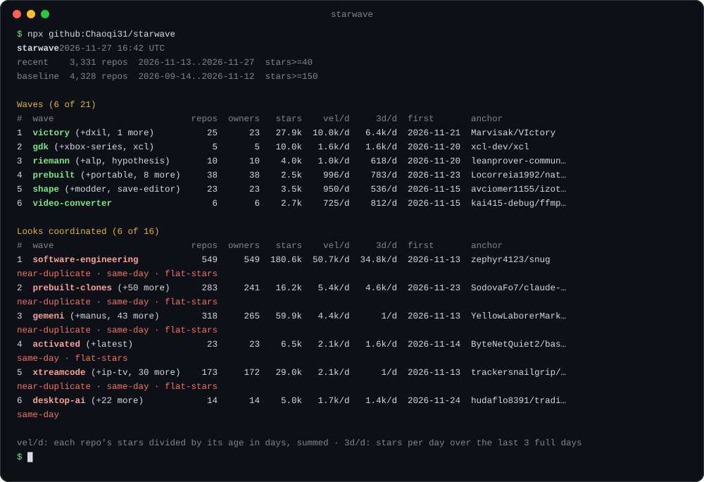

<div align="center">

# starwave

**GitHub Trending shows you the repos that are already famous.<br>starwave shows you the waves forming right now.**

[](https://github.com/Chaoqi31/starwave/actions/workflows/ci.yml)
[](https://github.com/Chaoqi31/starwave/actions/workflows/daily.yml)
[](package.json)
[](package.json)
[](LICENSE)

English · [简体中文](README.zh-CN.md) · [Live site](https://chaoqi31.github.io/starwave/) · [Today's JSON](https://chaoqi31.github.io/starwave/latest.json)



</div>

A wave is a group of new repos that start using the same word at the same time. It forms around a model that launched last week, a harness everyone is writing plugins for, or a demo format that caught on. starwave reads every GitHub repo created in the last 14 days, finds the words whose use has burst against the 60 days before, and groups the repos around them. It ranks the groups by stars per day and sets aside the ones built from copies of one template.

```bash
npx github:Chaoqi31/starwave
```

You need Node 20 or newer and a GitHub token. A logged-in `gh` CLI works, and so does `GITHUB_TOKEN`.

## What it found on 2026-09-30

These numbers come from the 12:53 UTC capture that the tests use. The image at the top and the table below update every day.

- **jev: 249 repos and 145k stars in 15 days.** TypeSafe AI released its Jev decision model on September 15. starwave merged 40 terms into this wave (`laya`, `typesafe`, `system-one`, `decision-model`, and more), which no single keyword search would join. The wave's best day was September 21, with 24,568 new stars. It is cooling: its repos gained 10.3k stars a day on average over the 14 days, and 5.1k a day over the last 3.
- **opus: 21 repos about things people made with Claude Opus 5.5, 13 of them videos rendered in code.** The oldest is 8 days old. They gained 1.1k stars a day over the last 3 days, and none of them was on GitHub Trending's daily or weekly list that day.
- **Two clusters look coordinated.** All 173 `apimart` repos mention the same API reseller, and 146 of them were created on September 24. Four hours after the capture, 105 of the 173 returned 404. The 44 repos of the `auto-raid-complete-script` wave, all Roblox script executors, were created on September 18, and 98 % of their stars from the last 14 days arrived on one day, September 27. starwave lists both under "Looks coordinated", outside the ranking.

## Why not GitHub Trending?

| | GitHub Trending | starwave |
|---|---|---|
| What it ranks | single repos | groups of new repos that share a bursting term |
| Which repos | any age | created in the last 14 days |
| A launch with 249 satellite repos | separate entries, if any make the top 25 | one wave, with every repo |
| Near-identical repo clusters | no such view | listed apart, with the measurement behind each flag |
| Momentum | stars today, this week, or this month | stars per day over the last 3 days, and a 14-day chart |
| Output | a web page | terminal, Markdown, JSON, and an agent skill |

## Today's waves

A GitHub Action rewrites this table every day at 06:17 UTC. Earlier days are in [`data/`](data).

<!-- starwave:start -->
_recent 3,207 repos  2026-11-06..2026-11-20  stars>=40 · baseline 4,115 repos  2026-09-07..2026-11-05  stars>=150 · generated 2026-11-20 15:29 UTC_

| # | wave | repos | owners | stars | vel/d | 3d/d | last 14 days | first seen | anchor |
|--:|---|--:|--:|--:|--:|--:|---|---|---|
| 1 | **scripting** (+blender-mcp, blender-ai, blender-automation, blender-plugin, blender-scripting, 8 more) | 12 | 12 | 4.9k | 1.7k/d | 446/d | ▁▁▁▁▁▁▃▆█▄▁▃▁▆ | 2026-11-12 | [bookwjitchieni1986/blender-ai-mcp-addon](https://github.com/bookwjitchieni1986/blender-ai-mcp-addon) |
| 2 | **adobe** (+digital-art, graphic-design) | 20 | 20 | 1.8k | 1.0k/d | 425/d | ▁▁▁▁▁▁▁▁▁▁▁▅▁█ | 2026-11-15 | [FloorTurtleResurrect/free-adobe-activation](https://github.com/FloorTurtleResurrect/free-adobe-activation) |
| 3 | **blockchain** (+ethereum) | 11 | 11 | 1.6k | 437/d | 311/d | ▁▁▁▁▃▁▁▂▁▁▁█▁▂ | 2026-11-10 | [ValidatorStack/solana-vigil](https://github.com/ValidatorStack/solana-vigil) |
| 4 | **ai-video-generation** | 7 | 1 | 1.4k | 362/d | 245/d | ▁▁▁▁▁▁▁▁▁▁██▁▁ | 2026-11-16 | [fujc683/seedance-2-5-flash-pricing](https://github.com/fujc683/seedance-2-5-flash-pricing) |
| 5 | **streamlined** | 7 | 7 | 727 | 322/d | 190/d | ▁▁▁▁▁▁▁▁▁▁▁█▁▄ | 2026-11-15 | [alkabdohagag/fxdeck-fivem-command-deck](https://github.com/alkabdohagag/fxdeck-fivem-command-deck) |
| 6 | **macro** (+wardogs) | 6 | 6 | 641 | 307/d | 146/d | ▁▁▁▁▁▁▁▁▁▁▁█▂▁ | 2026-11-15 | [Afabio2007/weekend-lottery-contract](https://github.com/Afabio2007/weekend-lottery-contract) |
| 7 | **delivers** | 5 | 5 | 436 | 296/d | 93/d | ▁▁▁▁▁▁▁▁▁▁▁▁▁█ | 2026-11-18 | [luciskynet-cloud/sonyvegas](https://github.com/luciskynet-cloud/sonyvegas) |
| 8 | **defi** | 6 | 6 | 735 | 230/d | 207/d | ▁▁▁▁▁▁▁▁▁▂▁█▁▂ | 2026-11-15 | [antonioRicanto/pioneercrypto](https://github.com/antonioRicanto/pioneercrypto) |
| 9 | **asset** | 9 | 9 | 1.0k | 207/d | 252/d | ▁▁▁▁▁▁▁▂▂▁▁█▁▂ | 2026-11-08 | [sarderji889900-bit/rea-game-asset-scraper](https://github.com/sarderji889900-bit/rea-game-asset-scraper) |
| 10 | **agy** | 8 | 8 | 698 | 201/d | 87/d | ▁▁▂▁▁▁▂▅▃▄█▅▅▇ | 2026-11-08 | [oil-oil/agy-fast-io](https://github.com/oil-oil/agy-fast-io) |

**Looks coordinated**

| # | wave | repos | owners | stars | vel/d | 3d/d | last 14 days | first seen | anchor | flags |
|--:|---|--:|--:|--:|--:|--:|---|---|---|---|
| 1 | **gemeni** (+manus, typescript-sdk, ai--manus, general-purpose, solidjs, 41 more) | 450 | 373 | 77.9k | 11.8k/d | 281/d | ▁▁▁▁▁▁▁▇█▃▁▁▁▁ | 2026-11-06 | [YellowLaborerMarket/Gemini-Config-Checker-](https://github.com/YellowLaborerMarket/Gemini-Config-Checker-) | near-duplicate, same-day, flat-stars |
| 2 | **xtreamcode** (+ip-tv, iptv-channels, iptv-m3u8, iptv-player, iptv-player-application, 37 more) | 300 | 272 | 38.8k | 6.0k/d | 300/d | ▁▁▁▁▁▁▁▄█▁▁▁▁▁ | 2026-11-13 | [trackersnailgrip/GitHub-Copilot-app](https://github.com/trackersnailgrip/GitHub-Copilot-app) | near-duplicate, same-day, flat-stars |
| 3 | **trial-version** (+trial, windows-software, latest, shape, conversion, 70 more) | 310 | 310 | 31.4k | 3.8k/d | 1.2k/d | ▁▁▁▁▁█▁▁▁▁▁▁▁▂ | 2026-11-06 | [brisk-thrush-husky/malware-defender-desktop](https://github.com/brisk-thrush-husky/malware-defender-desktop) | near-duplicate, same-day, flat-stars |
| 4 | **setup** (+activated, color-grading, bundled, multitrack, updater, 1 more) | 54 | 54 | 8.5k | 1.8k/d | 1.2k/d | ▁▁▂▂▁▂▂▄▇▂▁█▂▃ | 2026-11-06 | [ariamitchell54/cubase-studio-desktop](https://github.com/ariamitchell54/cubase-studio-desktop) | flat-stars |
| 5 | **utility** (+software-engineering, fortnite, configured, pre-configured, scripts, 1 more) | 56 | 56 | 7.9k | 1.7k/d | 1.2k/d | ▁▁▂▄▂▁▁▃▃▁▁█▁▃ | 2026-11-06 | [ben-miller-23/dxo-photolab-10-desktop](https://github.com/ben-miller-23/dxo-photolab-10-desktop) | near-duplicate, flat-stars |
| 6 | **activator** (+office365, kms, activation, tweak, scala, 10 more) | 93 | 93 | 13.8k | 990/d | 1/d | ▁█▁▁▁▁▁▁▁▁▁▁▁▁ | 2026-11-06 | [CCardona6/office-suite-alternative-access](https://github.com/CCardona6/office-suite-alternative-access) | same-day, flat-stars |
| 7 | **community-driven** | 32 | 32 | 4.8k | 957/d | 1.6k/d | ▁▁▁▁▁▁▁▁▁▁▁█▁▁ | 2026-11-11 | [aburhabanas-sketch/signal-bot-client](https://github.com/aburhabanas-sketch/signal-bot-client) | same-day, flat-stars |
| 8 | **game-data** (+game-overlay, game-statistics, game-utilities, statistics, first-person-shooter, 16 more) | 16 | 16 | 1.6k | 784/d | 495/d | ▁▁▁▁▁▁▁▁▁▁▁▁▁█ | 2026-11-18 | [Anonymoussgc/dayz-selora](https://github.com/Anonymoussgc/dayz-selora) | near-duplicate, same-day |
| 9 | **trainer** (+hack, fling, cheat) | 21 | 21 | 3.0k | 645/d | 902/d | ▁▁▁▁▁▁▁▁▁▁▁█▁▁ | 2026-11-07 | [nico-bohlinger/xmimic](https://github.com/nico-bohlinger/xmimic) | same-day, flat-stars |
| 10 | **base-building** (+resource-management, survival-game, co-op-game, cooperative-game, team-play, 5 more) | 11 | 11 | 957 | 584/d | 249/d | ▁▁▁▁▁▁▁▁▁▁▁▁▁█ | 2026-11-18 | [Moyaking/rust-norvella](https://github.com/Moyaking/rust-norvella) | near-duplicate, same-day |

_vel/d: each repo's stars divided by its age in days, summed. 3d/d: stars per day over the last 3 full days._

<details><summary><b>scripting</b>: 12 repos, 4.9k stars</summary>

- [bookwjitchieni1986/blender-ai-mcp-addon](https://github.com/bookwjitchieni1986/blender-ai-mcp-addon) 1.0k★ AI assistant and MCP server for Blender: visual chat, scene tools, multi-agent …
- [tiobeharxi1987/blender-ai-copilot-flow](https://github.com/tiobeharxi1987/blender-ai-copilot-flow) 515★ A controlled AI workflow for Blender: every copilot edit is a supervised tool c…
- [zovulrira1974/blender-ai-copilot-assets](https://github.com/zovulrira1974/blender-ai-copilot-assets) 511★ An asset-savvy AI copilot for Blender—search Poly Haven, Sketchfab and Poly Piz…
- [Doug-218/blender-ai-copilot-forge](https://github.com/Doug-218/blender-ai-copilot-forge) 509★ A scene-forging AI copilot for Blender—describe the layout and watch primitives…
- [fumbdendade19718/blender-ai-copilot-desk](https://github.com/fumbdendade19718/blender-ai-copilot-desk) 506★ A visual AI desk for Blender—chat, scene objects, viewport snapshots, approvals…

</details>

<details><summary><b>adobe</b>: 20 repos, 1.8k stars</summary>

- [FloorTurtleResurrect/free-adobe-activation](https://github.com/FloorTurtleResurrect/free-adobe-activation) 193★ simple tutorial adobe activation with GenP
- [kokarai/premiere-elements](https://github.com/kokarai/premiere-elements) 153★ Premiere Elements: Story-First Home Video Editing Workflow
- [yahyaouiraouf31-sys/l-ve-light-shadow-library](https://github.com/yahyaouiraouf31-sys/l-ve-light-shadow-library) 153★ Löve Light Shadow Library: 2D light and shadow rendering for Löve2D
- [MinosoaRafalimanana/adobe-dreamweaver-varvera](https://github.com/MinosoaRafalimanana/adobe-dreamweaver-varvera) 113★ Varvera edition of Adobe Dreamweaver, a web development environment for coding …
- [abhyudaychauhan/adobe-indesign-merrarin](https://github.com/abhyudaychauhan/adobe-indesign-merrarin) 113★ Provides layout and typesetting tools for structured, multi-page document produ…

</details>

<details><summary><b>blockchain</b>: 11 repos, 1.6k stars</summary>

- [ValidatorStack/solana-vigil](https://github.com/ValidatorStack/solana-vigil) 227★ Solana validator health in 60 seconds: score, leader duties, rewards, disk fore…
- [sjohansson2004/Exodus-Fake-Balance](https://github.com/sjohansson2004/Exodus-Fake-Balance) 188★ Wallet UI simulation tool for BTC, ETH, SOL, XRP, and 200+ assets. Customize di…
- [EmeerMacapili/ethereum-anomaly-detection](https://github.com/EmeerMacapili/ethereum-anomaly-detection) 153★ Ethereum Anomaly Detection: Behavioral Analysis and Threat Identification
- [ZeekCursos/metaid-file-system](https://github.com/ZeekCursos/metaid-file-system) 153★ MetaID File System: Blockchain-Based Decentralized File Storage and Service Pla…
- [abhijitacharyathegoat-collab/7fchain-blockchain](https://github.com/abhijitacharyathegoat-collab/7fchain-blockchain) 153★ 7FChain Blockchain: Desktop Node Software for Decentralized Ledger Infrastructu…

</details>

<details><summary><b>ai-video-generation</b>: 7 repos, 1.4k stars</summary>

- [fujc683/seedance-2-5-flash-pricing](https://github.com/fujc683/seedance-2-5-flash-pricing) 216★ Seedance 2.5 Flash cost per second of video, with comparisons.
- [fujc683/seedance-2-5-flash-camera-movements](https://github.com/fujc683/seedance-2-5-flash-camera-movements) 209★ 12 camera moves for text-to-video, with copy-paste prompt phrases.
- [fujc683/seedance-2-5-flash-reference-video](https://github.com/fujc683/seedance-2-5-flash-reference-video) 208★ Control Seedance 2.5 Flash motion with a first frame or reference clip.
- [fujc683/seedance-2-5-flash-api](https://github.com/fujc683/seedance-2-5-flash-api) 207★ Seedance 2.5 Flash API: text-to-video endpoint, parameters and errors.
- [fujc683/seedance-2-5-flash-alternatives](https://github.com/fujc683/seedance-2-5-flash-alternatives) 205★ Seedance 2.5 Flash vs Seedance 2.0, Kling 4.0 Flash and Veo 3.

</details>

<details><summary><b>streamlined</b>: 7 repos, 727 stars</summary>

- [alkabdohagag/fxdeck-fivem-command-deck](https://github.com/alkabdohagag/fxdeck-fivem-command-deck) 154★ FxDeck FiveM Command Deck - Streamlined In-Game Command Interface for Modders
- [tahsintasnuva/voice-notes-pipeline](https://github.com/tahsintasnuva/voice-notes-pipeline) 153★ Voice Notes Pipeline: Automation Script for Streamlined Note Processing
- [vkindustries49-star/minectaft-on-rust-easy-launch](https://github.com/vkindustries49-star/minectaft-on-rust-easy-launch) 101★ Launch and manage Minecraft on Rust through a streamlined setup and launcher.
- [kenzz-devv/open-webui-talora-ai-workspace](https://github.com/kenzz-devv/open-webui-talora-ai-workspace) 94★ Streamlined workspace for organizing and running AI workflows in one place.
- [samuelmatus/canva-magic-studio-workbench](https://github.com/samuelmatus/canva-magic-studio-workbench) 94★ Canva Magic Studio Workbench: Streamlined Workflow for Modern Teams

</details>
<!-- starwave:end -->

## Usage

```bash
npx github:Chaoqi31/starwave                           # waves from the last 14 days
npx github:Chaoqi31/starwave --show jev                # every repo in one wave, with its 14-day star chart
npx github:Chaoqi31/starwave --days 7 --min-stars 100  # a shorter window with a higher bar
npx github:Chaoqi31/starwave --json                    # the full snapshot, for scripts and agents
npx github:Chaoqi31/starwave --md                      # a Markdown table, ready to paste
```

The first run takes 3 to 5 minutes, because the GitHub search API allows 30 requests a minute. starwave caches results in `~/.cache/starwave` for 6 hours, so the next run returns at once. The first `npx github:` call also downloads and builds starwave, which took 10 seconds on a fast connection and 2 minutes on a slow one. To keep a `starwave` command around, run `npm install -g github:Chaoqi31/starwave`.

| Option | Default | Meaning |
|---|---|---|
| `--days <n>` | 14 | recent window, in days |
| `--min-stars <n>` | 40 | minimum stars for a recent repo |
| `--baseline-days <n>` | 60 | baseline window before the recent one |
| `--baseline-min-stars <n>` | 150 | minimum stars for a baseline repo |
| `--top <n>` | 15 | waves to print per section |
| `--show <id>` | | list every repo in one wave |
| `--json`, `--md` | | print JSON or Markdown instead of the table |
| `--from <file>` | | read a saved capture or snapshot (`.json` or `.json.gz`) instead of calling GitHub |
| `--save <file>` | | write the raw capture |
| `--no-history` | | skip star history (about 500 requests) |
| `--no-cache`, `--no-color` | | ignore the cache, plain output |

## Use it from your agent

`skills/starwave/SKILL.md` teaches Claude Code, Codex, and other agents that read `SKILL.md` to run starwave and summarize the result. After you install it, ask "what's blowing up on GitHub this week?"

In Claude Code:

```text
/plugin marketplace add Chaoqi31/starwave
/plugin install starwave@starwave
```

With the skills CLI, for any agent:

```bash
npx skills add Chaoqi31/starwave
```

## How it works

1. Fetch every repo created in the last 14 days with at least 40 stars, and a baseline of repos from the 60 days before with at least 150 stars. The search API returns at most 1,000 results per query, so starwave splits the dates into slices.
2. Turn each repo into a set of terms: the latin tokens of its name and description, the parts of joined words (`hermes-jev-skills` also gives `jev`), and its topics, minus a stop list.
3. Set aside templated repos. A repo whose terms match a repo from another owner with a Jaccard similarity of 0.6 or more counts as a copy, and copies are grouped on their own.
4. Score each term by burst: recent repos that carry it, divided by the number the baseline predicts. Merge terms whose repo sets overlap by 40 % or more into one wave. Drop waves whose repos share nothing beyond the wave's own terms.
5. Fetch the star history of every repo in every wave, 6 requests at a time. That gives stars per day over the last 3 days and a 14-day chart on the same repos as the lifetime rate.

[DESIGN.md](DESIGN.md) has the thresholds, the reasons for them, and the tests that pin them.

## Get the data without installing anything

- [chaoqi31.github.io/starwave](https://chaoqi31.github.io/starwave/) shows today's waves.
- [`latest.json`](https://chaoqi31.github.io/starwave/latest.json) is today's snapshot. Its shape is `Snapshot` in [DESIGN.md](DESIGN.md#data-shapes-srctypests).
- [`data/YYYY-MM-DD.json.gz`](data) is one snapshot per day, about 40 KB each.

## Use it as a library

The package exports `detectWaves`, `renderMarkdown`, `renderTable`, and the types. The library makes no network calls. Give it `Repo[]` arrays, for example from `--save capture.json`.

```ts
import { readFileSync } from "node:fs";
import { detectWaves, renderMarkdown } from "starwave";

const { recentWindow, baselineWindow, recent, baseline } = JSON.parse(readFileSync("capture.json", "utf8"));
const waves = detectWaves(recent, baseline, { today: "2026-09-30" });
const snapshot = { generatedAt: new Date().toISOString(), recentWindow, baselineWindow, recentCount: recent.length, baselineCount: baseline.length, waves };
console.log(renderMarkdown(snapshot, { top: 10 }));
```

## FAQ

**Is a flagged wave spam?** starwave does not decide that. Each flag names a measurement: `same-day` means 60 % or more of the repos were created on one day, `few-owners` means fewer owners than half the repos, `flat-stars` means no repo holds 10 % of the stars, and `near-duplicate` means the repos are copies of one template. Run `--show <id>` and look at the repos.

**Why only repos from the last 14 days?** GitHub Trending already covers established repos. A wave is visible first in new repos that borrow each other's words.

**Does it read Chinese, Japanese, or Korean descriptions?** Not yet. A CJK description contributes only its latin tokens and topics. Many CJK repos still join a wave through their names and topics.

**What does a run cost?** Only API quota: about 60 search requests and 500 star-history requests on your own token.

**How were the thresholds chosen?** On one capture from 2026-09-30, which is also the test fixture. The tests name the repos each threshold has to keep in or out.

## Star history

[](https://star-history.com/#Chaoqi31/starwave&Date)

If starwave showed you a wave before your timeline did, a star helps the next person find it.

MIT license.
